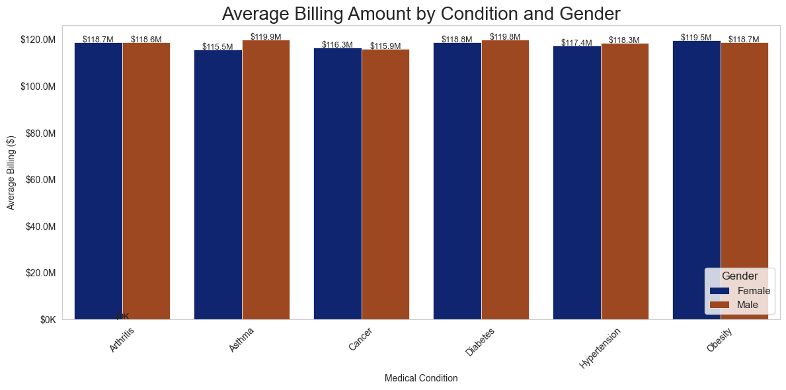

# Healthcare Dataset Analysis
## Overview
This project provides a comprehensive analysis of a healthcare dataset, covering exploratory data analysis (EDA), statistical insights, and predictive modeling. The goal is to uncover patterns in patient demographics, medical conditions, billing, and hospital operations, and to predict patient test results based on their medical profiles.
Features. You can find the dataset by cliking [here.](datasets\healthcare_dataset.csv)

* Data Preprocessing: Cleans and prepares raw healthcare data for analysis.
* Exploratory Data Analysis (EDA): Visualizes distributions of age, gender, medical conditions, and more.
* Statistical Analysis: Performs hypothesis testing and correlation studies.
* Predictive Modeling: Uses machine learning to predict patient test results.
* Time Series Analysis: Examines seasonal trends in hospital admissions.

## Dataset
The dataset includes the following key fields:
* Patient demographics (age, gender)
* Medical information (blood type, medical condition, medication)
* Hospital details (doctor, hospital, admission type)
* Financial data (billing amount, insurance provider)
* Test results (normal/abnormal) [Open the File](gender_analysis.ipynb)

## Requirements
`pandas, numpy, matplotlib, seaborn, scipy, scikit-learn, statsmodels`
##

## [Analyzing the Medical Condition](medical_condition.ipynb)

This is a grouped bar chart. The x-axis lists six different medical conditions: Arthritis, Asthma, Cancer, Diabetes, Hypertension, and Obesity. The y-axis represents the "Average Billing ($)" amount, scaled in millions. For each medical condition, there are two adjacent bars: dark blue representing the average billing for female patients and brown representing the average billing for male patients. The exact average billing amount is labeled above each bar.

### Breaking Down the chart
1. **Overall Average Billing:** The average billing amounts across all conditions and genders are relatively high, generally ranging between approximately $115 million and $120 million. This suggests significant healthcare costs associated with these conditions.
2. **Arthritis:** The average billing amount for females with Arthritis ($119.7 million) is slightly higher than that for males ($118.6 million).

3. **Asthma:** The average billing amount for females with Asthma ($115.5 million) is slightly lower than that for males ($119.9 million). This is a notable reversal of the trend seen in Arthritis.

4. **Cancer:** The average billing amount for females with Cancer ($116.3 million) is slightly higher than that for males ($115.9 million), although the difference is very small.

5. **Diabetes:** The average billing amount for females with Diabetes ($118.8 million) is slightly lower than that for males ($119.8 million).

6. **Hypertension:** The average billing amount for females with Hypertension ($117.4 million) is slightly lower than that for males ($118.3 million).

7. **Obesity:** The average billing amount for females with Obesity ($119.5 million) is slightly higher than that for males ($118.7 million).